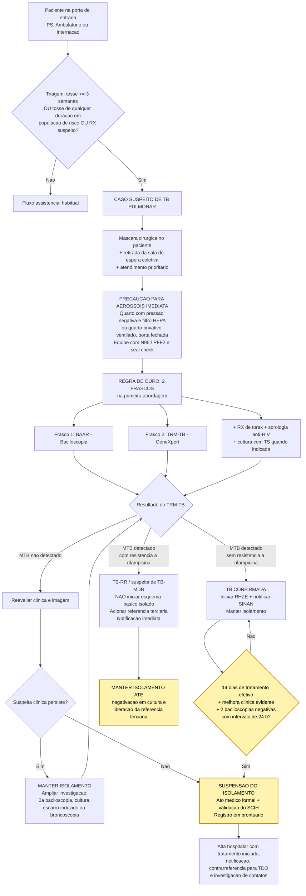

# POP – Protocolo de Identificação, Isolamento e Diagnóstico de Casos Suspeitos de Tuberculose Pulmonar Ativa no Hospital Evangélico

## Cabeçalho e Controle de Qualidade Documental

| Campo | Conteúdo |
|---|---|
| **Instituição / Serviço** | Hospital Evangélico (HE) – Serviço de Controle de Infecção Hospitalar (SCIH) |
| **Título do Documento** | POP – Protocolo de Identificação, Isolamento e Diagnóstico de Casos Suspeitos de Tuberculose Pulmonar Ativa |
| **Código do Documento** | POP-SCIH-TB-001 |
| **Versão** | 1.0 |
| **Data de Emissão** | 25/08/2026 |
| **Data da Próxima Revisão** | 25/08/2028 (ou a qualquer tempo, mediante atualização normativa do Ministério da Saúde/ANVISA) |
| **Setores Aplicáveis** | Pronto-Socorro, Recepção, Triagem/Acolhimento com Classificação de Risco, Ambulatórios, Unidades de Internação, Unidade de Terapia Intensiva (UTI), Centro Cirúrgico, Serviço de Imagem, Fisioterapia Respiratória, Higienização/Hotelaria, Transporte Interno e Laboratório de Análises Clínicas |
| **Elaborado por** | Serviço de Infectologia / SCIH |
| **Revisado por** | Gerência de Qualidade Assistencial e Segurança do Paciente |
| **Aprovado por** | Diretoria Clínica |
| **Substitui** | Não se aplica (documento inaugural) |
| **Anexos** | Fluxograma de Manejo Clínico (Seção 6); Referências Normativas (Seção 7) |

> **Aviso de controle documental:** este POP é documento institucional controlado. Cópias impressas são consideradas **não controladas**. A versão vigente é exclusivamente a disponibilizada pelo Núcleo de Gestão da Qualidade do HE.

---

## 1. Objetivo e Campo de Aplicação

### 1.1 Objetivo

Estabelecer conduta padronizada, imperativa e auditável para **identificar precocemente**, **isolar imediatamente** e **diagnosticar com agilidade** todo caso suspeito de tuberculose (TB) pulmonar ou laríngea ativa atendido no Hospital Evangélico, com as seguintes finalidades:

1. **Interromper a cadeia de transmissão intra-hospitalar** do *Mycobacterium tuberculosis*, protegendo pacientes, acompanhantes, visitantes e trabalhadores da saúde;
2. **Reduzir o tempo entre a suspeita clínica e o resultado diagnóstico**, por meio da coleta otimizada de amostras já na primeira abordagem;
3. **Assegurar o início oportuno do tratamento** e a detecção precoce de resistência à rifampicina;
4. **Garantir a notificação compulsória** do caso e a continuidade do cuidado na rede de atenção à saúde;
5. **Definir critérios objetivos e seguros** para a manutenção e a descontinuação do isolamento respiratório.

### 1.2 Campo de Aplicação

Este POP é de **cumprimento obrigatório** por todos os profissionais que atuam nas portas de entrada e nas unidades assistenciais do HE, a saber:

- **Equipe médica** (plantonistas, diaristas, especialistas e residentes);
- **Equipe de enfermagem** (enfermeiros, técnicos e auxiliares);
- **Equipe de recepção, cadastro e acolhimento**, responsável pela triagem inicial de sintomas respiratórios;
- **Equipe de fisioterapia respiratória**, com atenção especial aos procedimentos geradores de aerossóis;
- **Equipe do Laboratório de Análises Clínicas**, responsável pelo processamento prioritário das amostras;
- **Equipes de higienização, hotelaria, transporte interno, imagem e nutrição**, no que se refere à circulação e ao contato com o paciente em precaução para aerossóis.

### 1.3 Responsabilidades

| Função | Responsabilidade |
|---|---|
| Recepção / Acolhimento | Aplicar a triagem de sintoma respiratório; ofertar máscara cirúrgica; sinalizar imediatamente à enfermagem |
| Enfermeiro da Triagem | Confirmar o critério de caso suspeito; instituir precaução para aerossóis; acionar o médico assistente |
| Médico Assistente | Confirmar a suspeição, solicitar exames, prescrever a coleta dos **2 frascos**, avaliar radiografia de tórax, iniciar tratamento quando indicado e decidir sobre a suspensão do isolamento |
| SCIH | Auditar a adesão ao POP, validar a suspensão do isolamento, monitorar exposições ocupacionais e conduzir a investigação de contatos institucionais |
| Laboratório | Processar BAAR e TRM-TB em caráter de urgência; comunicar resultados críticos por telefone |
| Núcleo de Vigilância Epidemiológica Hospitalar (NVEH) | Realizar a notificação compulsória e a comunicação à Vigilância Epidemiológica municipal |

---

## 2. Definições e Critérios de Caso Suspeito

### 2.1 Definições Operacionais

- **Sintomático Respiratório (SR):** pessoa com **tosse por 3 (três) semanas ou mais** na população geral.
- **Sintomático Respiratório em populações vulneráveis:** nas populações de maior risco descritas no item 2.3, considera-se SR a pessoa com **tosse de qualquer duração**.
- **Caso suspeito de TB pulmonar ativa:** todo SR, ou todo paciente com achado clínico-radiológico compatível, ainda sem confirmação laboratorial.
- **Caso confirmado de TB:** caso com **TRM-TB com *M. tuberculosis* detectado**, **baciloscopia positiva** e/ou **cultura positiva** para o complexo *M. tuberculosis*; ou caso sem confirmação laboratorial, mas com diagnóstico clínico-radiológico firmado por médico assistente, com decisão de tratar.
- **Precaução para Aerossóis:** conjunto de medidas de barreira destinadas a bloquear a transmissão por partículas < 5 µm, que permanecem suspensas no ar e percorrem longas distâncias.
- **Procedimento Gerador de Aerossol (PGA):** nebulização, escarro induzido, aspiração de vias aéreas, intubação e extubação orotraqueal, broncoscopia, ventilação não invasiva, fisioterapia respiratória e reanimação cardiopulmonar.

### 2.2 Critérios Clínicos de Triagem (Gargalo de Triagem)

**Instituir suspeição diagnóstica** diante de **tosse por 3 semanas ou mais**, isoladamente ou associada a um ou mais dos sinais e sintomas abaixo:

- Febre, tipicamente **vespertina**, de baixa intensidade;
- **Sudorese noturna** profusa;
- **Emagrecimento** e inapetência;
- Astenia / adinamia progressiva;
- **Hemoptise** ou expectoração hemoptoica;
- Dor torácica e dispneia;
- **Alterações radiológicas suspeitas**: infiltrado em lobos superiores ou segmento apical dos lobos inferiores, cavitações, nódulos, padrão miliar ou derrame pleural sem outra causa definida.

> **Regra imperativa:** a presença de **radiografia de tórax sugestiva** em paciente com sintomas respiratórios **é suficiente**, por si só, para instituir a precaução para aerossóis, **independentemente do tempo de tosse**.

### 2.3 Fluxo Prioritário – Populações de Maior Risco

Nas populações abaixo, **investigar TB diante de tosse de qualquer duração** e **priorizar** a coleta e o processamento das amostras:

- **Pessoas vivendo com HIV/aids (PVHIV)** — investigar sistematicamente os quatro sintomas-chave: tosse, febre, emagrecimento e sudorese noturna;
- **Imunodeprimidos** por qualquer causa: uso de imunobiológicos anti-TNF, corticoterapia prolongada, quimioterapia, transplantados, pacientes em diálise e portadores de neoplasias hematológicas;
- **Contatos domiciliares e institucionais** de caso confirmado de TB pulmonar;
- **Pessoas em situação de rua**;
- **População privada de liberdade** e egressos do sistema prisional;
- **Profissionais de saúde**;
- **Povos indígenas**;
- **Pessoas com diabetes mellitus, tabagistas, etilistas e usuários de outras drogas**;
- **Pacientes com história de tratamento prévio para TB** (retratamento, abandono ou falência), nos quais há **maior risco de resistência**.

> **Alerta clínico:** em PVHIV com imunossupressão avançada e em crianças, a apresentação pode ser **atípica ou paucibacilar**, com radiografia normal ou inespecífica. **A baixa suspeição não autoriza a dispensa do isolamento.**

---

## 3. Protocolo de Biossegurança: Precaução para Aerossóis

### 3.1 Princípio Imperativo

**A precaução para aerossóis deve ser instituída no momento da suspeição, na própria triagem, ANTES de qualquer confirmação laboratorial.** É expressamente **vedado** aguardar resultado de exame, avaliação de especialista ou vaga em quarto ideal para adotar as medidas de barreira.

### 3.2 Condutas na Recepção e na Triagem (primeiros 5 minutos)

1. **Ofertar imediatamente máscara cirúrgica ao paciente**, orientando o uso contínuo, cobrindo boca e nariz, com troca sempre que úmida ou danificada;
2. **Orientar a etiqueta respiratória**: cobrir boca e nariz ao tossir ou espirrar, descartar lenços em lixeira com tampa e higienizar as mãos em seguida;
3. **Retirar o paciente da sala de espera coletiva**, encaminhando-o prioritariamente a área de espera individualizada e ventilada;
4. **Sinalizar o atendimento como prioritário** na classificação de risco;
5. **Acionar o enfermeiro e o médico assistente** para confirmação da suspeição e prescrição da coleta.

### 3.3 Acomodação do Paciente

Em ordem decrescente de preferência:

1. **Quarto de isolamento respiratório com pressão negativa**, com **6 a 12 trocas de ar por hora**, filtro **HEPA** e exaustão adequada, **com porta obrigatoriamente fechada**;
2. Na indisponibilidade: **quarto privativo, com porta fechada e boa ventilação natural**, preferencialmente com janelas amplas mantidas abertas e fluxo de ar direcionado para o exterior — **nunca** para corredores ou áreas de circulação interna;
3. **É vedado** manter paciente suspeito ou confirmado de TB pulmonar em enfermaria coletiva, em corredor ou em coorte com pacientes portadores de outros agentes.

**Sinalização obrigatória:** afixar na porta do quarto a **placa institucional de PRECAUÇÃO PARA AEROSSÓIS**, sem qualquer menção ao diagnóstico, preservando a confidencialidade do paciente.

### 3.4 Equipamentos de Proteção Individual (EPI) para o Profissional

Antes de **cada** entrada no quarto:

| EPI | Especificação e uso |
|---|---|
| **Respirador N95 / PFF2 (ou superior)** | **Obrigatório para todo profissional, visitante ou acompanhante**, a cada entrada. Colocar **antes** de entrar e retirar **somente após** deixar o quarto e fechar a porta. Realizar **verificação de vedação (*seal check*)** a cada uso: cobrir o respirador com as mãos, inspirar e expirar, confirmando ausência de escape de ar pelas bordas. **Vedado o uso sobre barba** ou sobre outra máscara |
| **Higiene das mãos** | Obrigatória **antes e depois** do contato com o paciente e do contato com o ambiente, com água e sabão ou preparação alcoólica a 70% |
| Avental, luvas e óculos/protetor facial | Conforme risco de contato com sangue, secreções ou respingos, e nos procedimentos geradores de aerossóis |

### 3.5 Procedimentos Geradores de Aerossóis (PGA)

- Realizar PGA **exclusivamente** em quarto de isolamento com pressão negativa ou, na sua ausência, em ambiente privativo com ventilação adequada e porta fechada;
- **Restringir ao mínimo necessário** o número de profissionais presentes, todos com N95/PFF2;
- Após o procedimento, **respeitar o tempo de remoção de partículas** do ambiente antes da entrada de profissional sem proteção respiratória, conforme a taxa de trocas de ar do quarto;
- Priorizar sistemas fechados de aspiração e filtros nos circuitos ventilatórios.

### 3.6 Transporte Interno e Circulação

- **Restringir o transporte ao estritamente indispensável**; priorizar exames à beira do leito;
- Quando inevitável: paciente **obrigatoriamente com máscara cirúrgica** durante todo o trajeto; a equipe transportadora usa N95/PFF2;
- **Comunicar previamente** o setor de destino, que deve receber o paciente **sem tempo de espera** em áreas coletivas;
- Restringir visitas, vedando o acesso de **crianças e imunodeprimidos**; acompanhantes autorizados devem receber N95/PFF2 e orientação formal de uso.

### 3.7 Higienização do Ambiente e Resíduos

- Limpeza concorrente diária e limpeza terminal na alta, com desinfetante padronizado pelo SCIH;
- Profissional de higienização deve usar **N95/PFF2** durante toda a permanência no quarto;
- Resíduos e roupas: manejados como **infectantes (Grupo A)**, conforme o PGRSS institucional.

### 3.8 Notificação Compulsória e Saúde do Trabalhador

- A tuberculose é **doença de notificação compulsória**. Toda confirmação — laboratorial ou clínica — deve ser **notificada ao NVEH em até 7 dias**, com registro no **SINAN**;
- **TB drogarresistente e óbito por TB** exigem comunicação **imediata** ao NVEH e à Vigilância Epidemiológica;
- Exposição de profissional a caso bacilífero **sem uso de proteção respiratória** deve ser comunicada ao SCIH e ao SESMT para avaliação, investigação de infecção latente (ILTB) e seguimento.

---

## 4. Protocolo de Coleta e Exames: Fluxo dos 2 Frascos (BAAR e TRM-TB)

### 4.1 Regra de Ouro do HE – Dois Frascos na Primeira Abordagem

> **REGRA RÍGIDA INSTITUCIONAL:** todo caso suspeito de TB pulmonar deve ter **2 (dois) frascos de escarro coletados já na primeira abordagem** — primeira consulta ambulatorial, atendimento no Pronto-Socorro ou admissão hospitalar. **É vedado adiar a coleta para o dia seguinte ou para a transferência de setor.**

| Frasco | Exame destinado | Finalidade clínica |
|---|---|---|
| **Frasco 1** | **BAAR – Baciloscopia** (pesquisa de bacilo álcool-ácido resistente) | Estimar a **carga bacilar** e o **potencial de transmissibilidade**; subsidiar a decisão de manutenção do isolamento e o monitoramento do tratamento |
| **Frasco 2** | **TRM-TB – Teste Rápido Molecular** (sistema GeneXpert®) | Detectar o **DNA do complexo *M. tuberculosis*** e a **resistência à rifampicina**, com resultado em até 2 horas |

**Complementações obrigatórias:**

- **Segunda amostra de baciloscopia:** manter a coleta de amostra adicional **na manhã seguinte, ao despertar**, conforme preconizado pelo Ministério da Saúde, quando o paciente permanecer sob investigação;
- **Cultura para micobactérias com Teste de Sensibilidade (TS):** solicitar **sempre** que houver TRM-TB com *M. tuberculosis* detectado e, **obrigatoriamente e independentemente do resultado do TRM-TB**, nos seguintes grupos: PVHIV, crianças, retratamento (recidiva, reingresso após abandono ou falência), contatos de caso resistente, profissionais de saúde, populações vulneráveis e suspeita de TB extrapulmonar;
- **Sorologia anti-HIV:** oferecer a **todo** paciente com diagnóstico de TB;
- **Radiografia de tórax:** solicitar para todo caso suspeito.

### 4.2 Orientação de Técnica ao Paciente

Orientar de forma clara, com demonstração e confirmação de entendimento:

1. Coleta preferencialmente **matinal, ao despertar**, e **em jejum**;
2. **Escovar os dentes apenas com água**, sem creme dental, sem antisséptico bucal e sem gargarejo;
3. **Inspirar profundamente**, prender o ar por alguns segundos e **tossir com esforço vindo do peito** — não da garganta;
4. **Expectorar diretamente no frasco estéril**, de boca larga, aproximando-o dos lábios, sem tocar a borda interna;
5. Repetir a manobra até obter **volume de 5 a 10 mL** de material;
6. **Fechar firmemente o frasco** e higienizar as mãos ao término.

**Advertências técnicas:**

- **Saliva não é amostra válida** — orientar nova tentativa;
- A coleta deve ser feita **no interior do quarto de isolamento**, em área externa ventilada ou em cabine própria — **jamais** em banheiros coletivos, corredores, salas de espera ou postos de enfermagem;
- Se o paciente não expectorar espontaneamente, discutir com o médico assistente **escarro induzido** com solução salina hipertônica ou **aspirado/lavado brônquico**, sempre com precaução para aerossóis;
- Profissional que supervisiona a coleta permanece **fora da linha de tosse** do paciente, com N95/PFF2.

### 4.3 Rotulagem, Acondicionamento e Transporte

1. **Rotular imediatamente após a coleta**, na presença do paciente, com **dupla identificação** (nome completo e data de nascimento **ou** número de registro/prontuário), acrescida de data, hora da coleta, unidade solicitante e número da amostra (1ª ou 2ª);
2. **Rotular no corpo do frasco — nunca na tampa**;
3. **Sinalizar como URGENTE / PESQUISA DE TUBERCULOSE** na requisição e no invólucro;
4. Acondicionar em **saco plástico individual e lacrado**, transportado em **caixa térmica rígida** identificada com o símbolo de risco biológico, em **posição vertical**;
5. **Enviar imediatamente ao laboratório**. Não sendo possível, conservar sob **refrigeração de 2 °C a 8 °C**, protegido da luz, por no máximo **7 dias** — nunca no congelador;
6. **Não centrifugar, não adicionar conservantes e não transferir** o material entre frascos.

### 4.4 Compromisso de Resposta do Laboratório (TAT institucional)

| Exame | Prazo-alvo para liberação | Comunicação |
|---|---|---|
| **TRM-TB** | Até **24 horas** da chegada ao laboratório | Resultado **detectado** ou **resistência à rifampicina detectada** → comunicação **imediata por telefone** ao médico assistente e ao SCIH |
| **Baciloscopia (BAAR)** | Até **24 horas** | Resultado positivo → comunicação **imediata por telefone** |
| **Cultura com TS** | Conforme metodologia (líquida ou sólida) | Resultado com resistência → comunicação **imediata** ao médico assistente, SCIH e NVEH |

### 4.5 Interpretação dos Resultados

| Resultado do TRM-TB | Interpretação | Conduta |
|---|---|---|
| **MTB não detectado** | TB pulmonar **improvável**, porém **não excluída** — especialmente em paucibacilares, PVHIV e crianças | Manter isolamento até reavaliação clínica formal; prosseguir investigação com baciloscopia, cultura e imagem |
| **MTB detectado, sem resistência à rifampicina** | TB pulmonar confirmada, sensível à rifampicina | Iniciar esquema básico (RHZE); notificar; manter isolamento conforme Seção 5 |
| **MTB detectado, com resistência à rifampicina** | **TB resistente à rifampicina (TB-RR)** | **Não** iniciar esquema básico isoladamente; acionar a referência terciária; **manter isolamento rigorosamente** até orientação especializada e resultado de cultura/TS |
| **MTB detectado – traços (*trace*)** | Carga bacilar muito baixa; **não confirma isoladamente** o diagnóstico em todos os cenários | Interpretar em conjunto com clínica, imagem, história de tratamento prévio e cultura |

> **Advertências imperativas:**
> - O **TRM-TB detecta DNA**, inclusive de **bacilos inviáveis**, permanecendo positivo por meses após a cura. **É vedado seu uso para monitoramento de tratamento** ou para decidir a suspensão de isolamento em paciente com TB prévia — nestes casos, utilizar **baciloscopia e cultura**;
> - Em **retratamento**, o TRM-TB deve ser interpretado **obrigatoriamente** em conjunto com cultura e TS;
> - **Um único resultado "não detectado" não autoriza, isoladamente, a suspensão do isolamento** quando a suspeita clínico-radiológica permanece elevada.

---

## 5. Critérios para Retirada do Isolamento Respiratório

> *Seção de decisão institucional — destacada em grifo amarelo para localização rápida e edição pela equipe do HE conforme atualizações de protocolo.*

<mark>**REGRA GERAL:** a suspensão da precaução para aerossóis é **ato médico formal**, registrado em prontuário com data, hora, justificativa e identificação do responsável, e **validado pelo SCIH**. Nenhuma outra categoria profissional está autorizada a suspender o isolamento.</mark>

<mark>**5.1 – Caso suspeito com investigação negativa (TB descartada).** Suspender o isolamento quando houver, cumulativamente: **duas baciloscopias de escarro negativas**, coletadas com **intervalo mínimo de 24 horas**; **TRM-TB com *M. tuberculosis* não detectado**; **diagnóstico alternativo estabelecido** que explique o quadro clínico e radiológico; e **ausência de piora clínica ou radiológica**.</mark>

<mark>**5.2 – Caso confirmado em tratamento.** Suspender o isolamento somente quando houver, cumulativamente: **no mínimo 14 dias de tratamento antituberculose efetivo e regularmente administrado**; **melhora clínica evidente** — redução da tosse, defervescência e recuperação do estado geral; e **baciloscopias de controle negativas**, em pelo menos **duas amostras** coletadas com intervalo mínimo de 24 horas após o início do tratamento.</mark>

<mark>**5.3 – Manutenção obrigatória do isolamento.** É **vedada** a suspensão do isolamento, independentemente do resultado das baciloscopias, nas seguintes situações: **TB resistente à rifampicina, multirresistente (TB-MDR) ou extensivamente resistente (TB-XDR)** — nestes casos, manter o isolamento até **negativação em cultura** e orientação formal da referência terciária; **suspeita clínico-radiológica persistente** apesar de exames negativos; **irregularidade ou interrupção do tratamento**; e **TB laríngea**, pela elevada transmissibilidade.</mark>

<mark>**5.4 – Alta hospitalar.** A alta **não depende** da suspensão do isolamento. Paciente clinicamente estável, ainda bacilífero, **pode receber alta** desde que assegurados: **início efetivo do tratamento**; **orientação documentada** ao paciente e aos familiares sobre etiqueta respiratória, ventilação domiciliar e restrição de contato com crianças e imunodeprimidos; **notificação realizada**; **referenciamento formal à Atenção Primária** para tratamento diretamente observado (TDO); e **agendamento da investigação de contatos domiciliares**. **É vedada a alta sem contrarreferência registrada em prontuário.**</mark>

<mark>**5.5 – Registro e auditoria.** Toda suspensão de isolamento gera registro em prontuário e comunicação ao SCIH em até 24 horas, para fins de auditoria de adesão a este POP.</mark>

---

## 6. Fluxograma de Manejo Clínico

> **Nota de edição:** o bloco acima é código **Mermaid.js** (`graph TD`), diretamente editável em qualquer leitor de Markdown compatível. Os nós destacados em amarelo (`classDef destaque`) correspondem às regras de descontinuação do isolamento descritas na **Seção 5**.

---

## 7. Referências Normativas

1. **BRASIL. Ministério da Saúde. Secretaria de Vigilância em Saúde e Ambiente. Departamento de HIV/Aids, Tuberculose, Hepatites Virais e Infecções Sexualmente Transmissíveis. *Manual de Recomendações para o Controle da Tuberculose no Brasil*. 2. ed. Brasília: Ministério da Saúde.**
   - Documento de referência primária deste POP: <https://www.gov.br/saude/pt-br/centrais-de-conteudo/publicacoes/svsa/tuberculose/manual-de-recomendacoes-e-controle-da-tuberculose-no-brasil-2a-ed.pdf/@@download/file>
   - *[Espaço reservado para inserção do arquivo institucional do protocolo vigente, com versão e data de acesso registradas pelo Núcleo de Qualidade do HE.]*
2. **BRASIL. Ministério da Saúde. *Guia de Vigilância em Saúde*** — capítulo de Tuberculose (definições de caso, notificação compulsória e encerramento no SINAN).
3. **BRASIL. Ministério da Saúde. *Protocolo de Vigilância da Infecção Latente pelo Mycobacterium tuberculosis no Brasil*** — conduta em contatos e profissionais expostos.
4. **ANVISA. Agência Nacional de Vigilância Sanitária. *Medidas de Prevenção de Infecção Relacionada à Assistência à Saúde*** — precauções padrão e precauções baseadas na transmissão por aerossóis.
5. **ANVISA. *Segurança do Paciente em Serviços de Saúde: Higienização das Mãos*.**
6. **ORGANIZAÇÃO MUNDIAL DA SAÚDE (OMS/WHO). *WHO Guidelines on Tuberculosis Infection Prevention and Control*** e *WHO Consolidated Guidelines on Tuberculosis – Module 3: Diagnosis*.
7. **Portaria de Consolidação nº 4/2017, Ministério da Saúde** — Lista Nacional de Notificação Compulsória de doenças, agravos e eventos de saúde pública.
8. **Documentos institucionais correlatos do HE:** Manual de Precauções e Isolamento do SCIH; Plano de Gerenciamento de Resíduos de Serviços de Saúde (PGRSS); Protocolo de Acidente com Material Biológico e Exposição Ocupacional (SESMT).

---

### Nota Técnica de Elaboração

Este POP foi redigido em alinhamento às diretrizes do Ministério da Saúde do Brasil, da ANVISA e da OMS para tuberculose e controle de infecção hospitalar. **O arquivo PDF do *Manual de Recomendações para o Controle da Tuberculose no Brasil* (2ª ed.) indicado na referência 1 não pôde ser baixado no ambiente de geração deste documento** (acesso externo bloqueado pela política de rede). Recomenda-se, portanto, que o Serviço de Infectologia/SCIH do HE proceda à **conferência item a item das seções 2, 4 e 5 contra o texto oficial vigente** antes da aprovação final pela Diretoria Clínica, registrando a validação no controle documental. Parâmetros institucionais editáveis — prazos laboratoriais (item 4.4) e critérios de suspensão de isolamento (Seção 5) — devem ser homologados pela Comissão de Controle de Infecção Hospitalar (CCIH) do HE.
